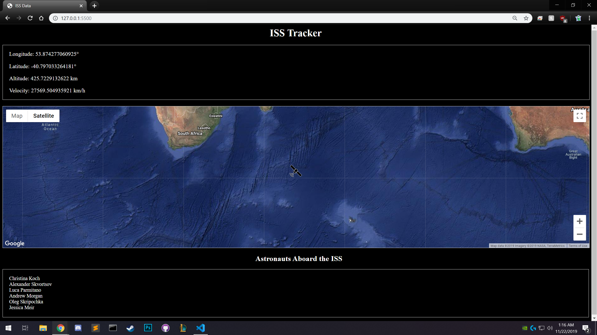

# [iss-tracker](https://iss.alanconstantino.com)
A website that tracks the location of the ISS in real-time using Javascript and some APIs.

[Link to ISS tracker](https://iss.alanconstantino.com)

# APIs used
- <a href="https://wheretheiss.at/w/developer">Where the ISS at? API</a>
  - Used for tracking the ISS (latitude, longitude, velocity, altitude, etc).
- <a href="http://open-notify.org/Open-Notify-API/People-In-Space/">Open Notify API</a>
  - Used for getting the names of the people aboard the ISS.
- <a href="https://developers.google.com/maps/documentation/javascript/tutorial">Google Maps API</a>
  - Used for displaying a map with a marker.
  
# Image

Gif

Static image

### Note
I had to hard code the "Astronauts Aboard the ISS" list because Heroku doesn't do http requests, only https. The Open Notify API uses http and that API is what I used to get the names of the astronauts aboard the ISS.
